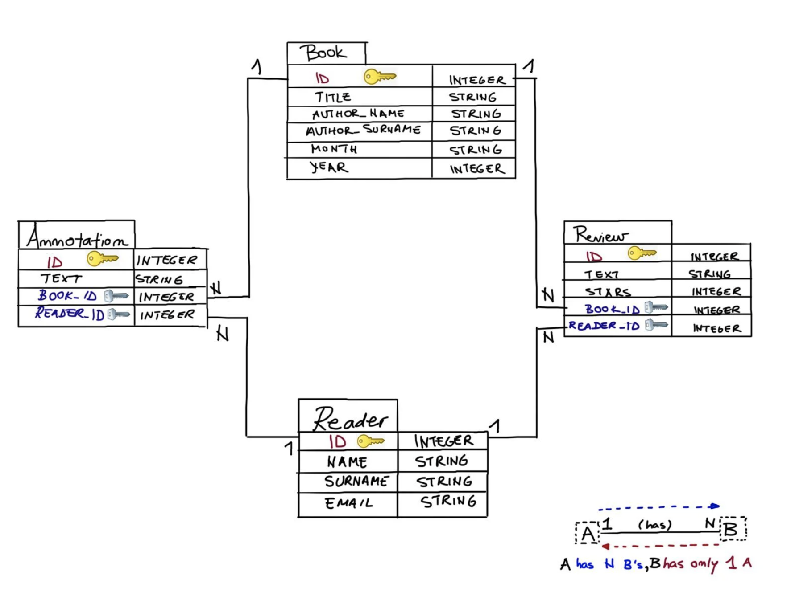

# Relational Databases

## Database schema design: A simple book club scenario

**Entities** in our database are Reader, Book, Review and Annotation. Those represent tables in the schema.

**Attributes** are properties of an entity and are represented as columns in a database table. For example, Reader’s attributes are NAME, SURNAME and EMAIL, and Review’s attributes are TEXT and STARS (representing ratings from 1 to 5).

**Relationships** are represented as arrows between tables. Readers are in a relationship with books by reviewing them and by making annotations. A reader can review and annotate multiple books. A book can have multiple reviews and annotations. Each review or annotation is associated with one book and one reader. We say that Reader is in a one-to-many relationship with Review, and Annotation. Similarly, Book is in a one-to-many relationship with Review and Annotation.
